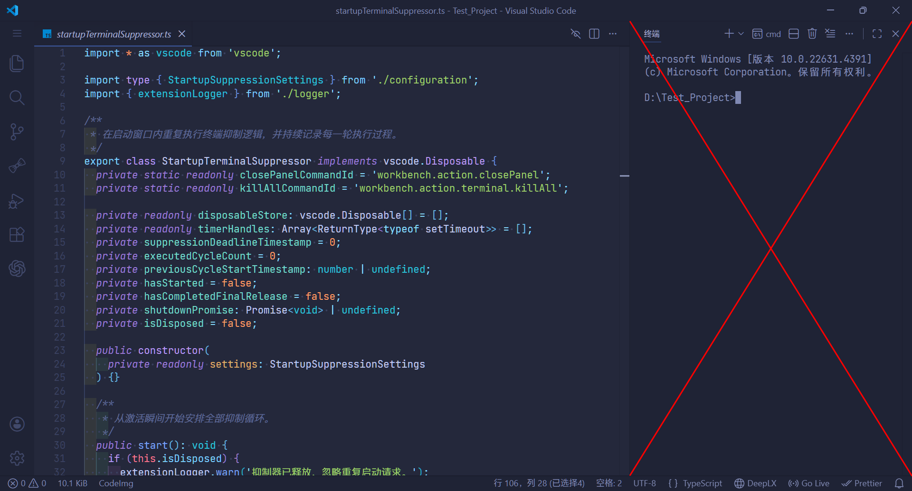

# TrmNilx



## 简介

这是一个 VSCode 插件，用于阻止 VSCode 在启动阶段自动弹出终端。

扩展激活后，在下次启动 VSCode 时，会在启动后的 1.5 秒内自动重复执行“终止所有终端”和“关闭所有终端面板”这两个操作。

该扩展仅处理终端及终端面板，不会处理编辑器、资源管理器、输出面板、问题面板和其他区域。

## 打包

```
npm install
npm run compile
npm run package:vsix
```

## 许可证

`Copyright © 2026 NianBroken. All rights reserved.`

本项目采用 [Apache-2.0](https://www.apache.org/licenses/LICENSE-2.0 "Apache-2.0") 许可证。简而言之，你可以自由使用、修改和分享本项目的代码，但前提是在其衍生作品中必须保留原始许可证和版权信息，并且必须以相同的许可证发布所有修改过的代码。

## 恰饭

[Great-Firewall](https://nianbroken.github.io/Great-Firewall/) 好用的 VPN

[Ciii](https://ciii.klaio.top/) Codex 中转

[Aizex](https://aizex.klaio.top/) ChatGPT 镜像站

以上绝对都是性价比最高的。

## 其他

欢迎提交 `Issues` 和 `Pull requests`